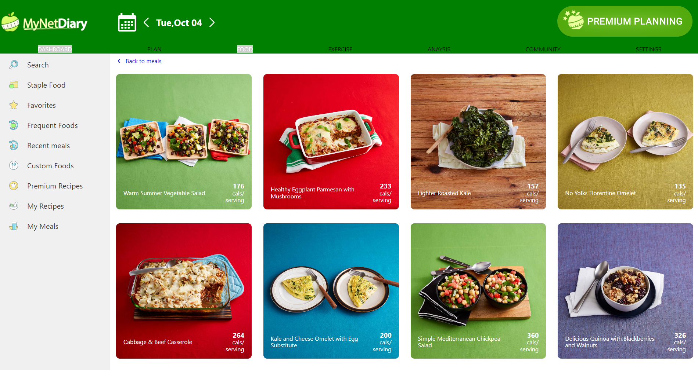
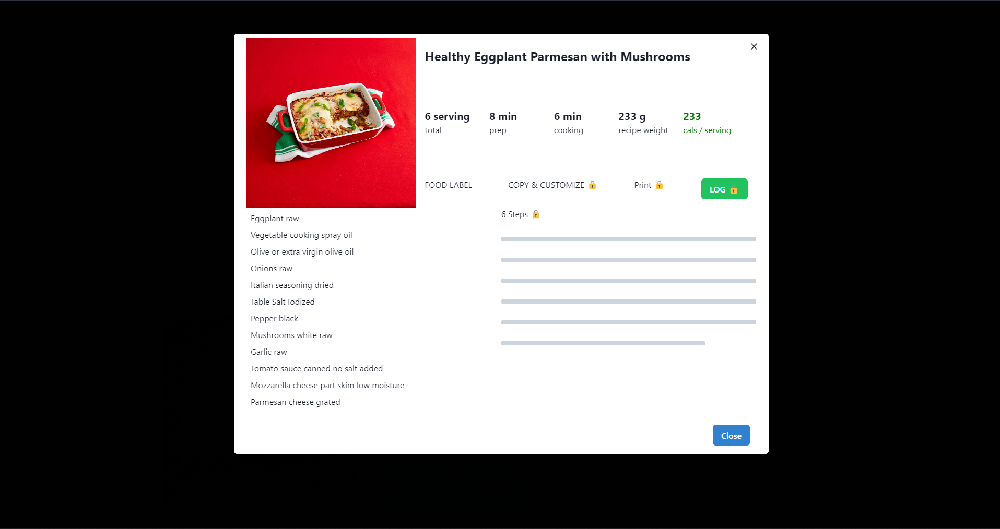

# MyNetDairy Clone

MyNetDiary is used to track and keep a record of diet. 🚴🥗

## Acknowledgements

**Original website link**: (https://www.mynetdiary.com/)

**Vercel link of our project**: https://mynetdiary-alpha.vercel.app/

## collaborators:

- [Lalith Sai](https://github.com/G-LalithSai)
- [gourav Sahu](https://github.com/gourav017)
- [Shakil Ahmad](https://github.com/ahmad-DS)
- [Mohammad zaki](https://github.com/Mohammadzaki0027)
- [Akash Subhash Bhoi](https://github.com/akashbhoi2815)

## Tech Stack:

<h1>Snapshots of our project</h1>

1. Landing page

2. Login Page

3. User Dashboard

4. Plan page

5. Food page

6. Recipe page

